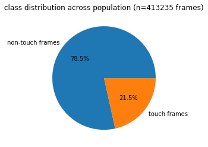

# Whisker Automated Contact Classifier 

## Premise: 
Many labs (e.g. [Hires Lab](https://www.hireslab.org/)) use tasks that involve whisker active touch against thin movable poles to study diverse questions of sensory and motor coding. Since neurons operate at temporal resolutions of milliseconds, determining precise whisker contact periods is essential. Yet, accurately classifying the precise moment of touch is time-consuming and labor intensive. Current classification techniques rely on semi-automated curation, infrared beam crossings, or hard coded distance to object thresholds. All involve substantial tradeoffs in analysis time or accuracy.  We propose the use of convolutional neural networks to fully automate the identification of whisker-object touch periods.

  
*Single example trial lasting 4 seconds. Example video (left) along with whisker traces, decomposed components, and spikes recorded from L5 (right). How do we identify the precise millisecond frame when touch occurs?*

## Data: 
Current dataset involves 400,000 semi-automated curated images. The distribution with sample images are listed below. 

## Code contributors:
WhACC code and software was originally developed by Jonathan Cheung and Phillip Maire in the laboratory of Samuel Andrew Hires. 